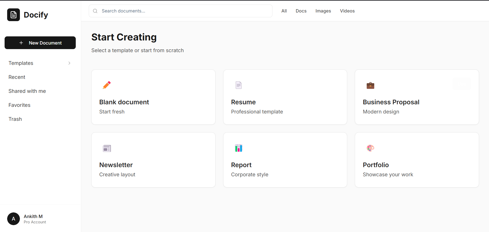
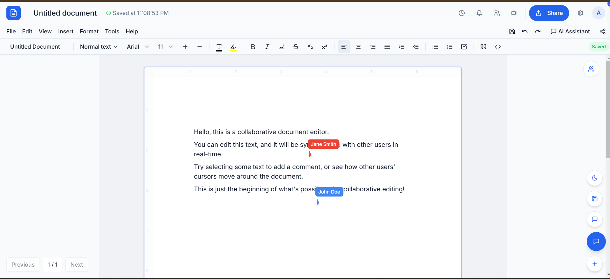

# Collaborative Document Editing Application

## Overview
This web application allows users to create, edit, and collaborate on documents in real-time. It provides a user-friendly interface for managing documents, making it easy for teams to work together efficiently.


## UI



## Key Features

1. **Real-time Collaboration**  
   - Multiple users can edit documents simultaneously with minimal latency.  
   - Includes live cursor tracking, conflict resolution, and inline comments.

2. **Document Templates**  
   - Start from a blank page or choose from professionally designed templates.  
   - Easily customize templates to fit your project or branding needs.

3. **Built-in Chat & Video Calls**  
   - Integrated chat panel for instant communication within each document.  
   - Optional video conferencing (e.g., Jitsi) to conduct live discussions or screen sharing.

4. **Version Control**  
   - Automatic or manual version snapshots for each document.  
   - Easily revert to previous versions or compare changes over time.

5. **User Authentication**  
   - Secure sign-up and login system with role-based permissions.  
   - OAuth support (e.g., Google, GitHub) for convenient single sign-on.

6. **Responsive Design**  
   - Optimized layouts for both desktop and mobile devices.  
   - Ensures a consistent, user-friendly experience across screens.

7. **Access Control & Sharing**  
   - Invite collaborators via email or shareable links.  
   - Set permissions to view, comment, or edit.

8. **Scalable & Extensible**  
   - Built with a modular architecture for easy integration of new features.  
   - Supports additional plugins (e.g., AI grammar suggestions) and third-party services.


## Installation

### Prerequisites
- **Node.js**: Ensure you have Node.js installed. You can download it from [Node.js Official Site](https://nodejs.org/).
- **npm**: Comes pre-installed with Node.js.

### Installation Steps
1. Clone the repository:
   ```bash
   git clone <YOUR_GIT_URL>
   ```

2. Navigate to the project directory:
   ```bash
   cd collaborative-docs-experience
   ```

3. Install the necessary dependencies:
   ```bash
   npm install
   ```

4. Start the development server:
   ```bash
   npm run dev
   ```

5. Open your browser and navigate to `http://localhost:3000` to access the application.

## Usage Instructions
- To create a new document, click on the "New Document" button in the sidebar.
- Select a template or start from scratch.
- Use the editor to make changes and collaborate with others in real-time.


## Contributors
- **Your Name** - [Ankith M]


## License
This project is licensed under the MIT License. See the LICENSE file for more details.
